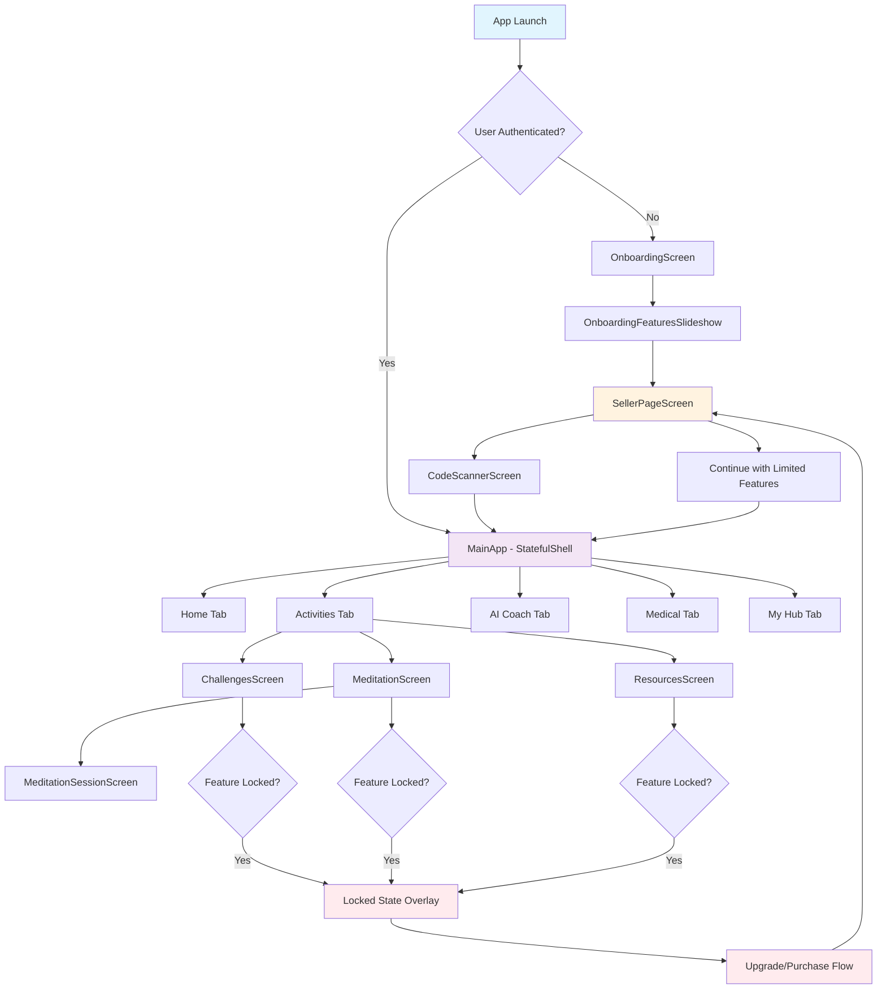
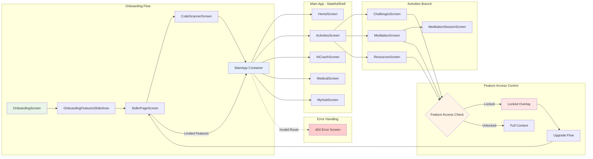

# ChronoWell App Navigation System Documentation

## Overview

ChronoWell uses a modern GoRouter-based navigation system that provides type-safe routing, deep linking capabilities, and a clean separation of concerns. The app has transitioned from a mixed navigation approach (CupertinoTabScaffold + Navigator.push) to a unified GoRouter system.

## Architecture

### Core Components

1. **AppRouter** (`lib/core/navigation/app_router.dart`)
   - Central router configuration using GoRouter
   - Defines all routes and navigation structure
   - Handles redirects and route guards

2. **AppRoutes** (Static route name constants)
   - Type-safe route names to prevent typos
   - Centralized route name management

3. **AppNavigation** (Navigation helper methods)
   - Convenient wrapper methods for common navigation patterns
   - Abstracts GoRouter complexity from UI components

## Route Structure

### Onboarding Flow
- **Entry Point**: `/onboarding`
- **Features Slideshow**: `/onboarding/features-slideshow`
- **Seller Page**: `/seller` (for supplement recommendations)
- **Code Scanner**: `/code-scanner` (for product verification)

### Main Application (Stateful Shell Route)
The main app uses a `StatefulShellRoute.indexedStack` with 5 primary tabs:

1. **Home Tab** (`/home`)
   - Landing screen after authentication
   - Dashboard with user overview

2. **Activities Tab** (`/activities`)
   - Hub for cognitive activities
   - **Challenges** (`/activities/challenges`)
   - **Meditations** (`/activities/meditations`)
     - **Session Detail** (`/activities/meditations/session/:sessionId`)
   - **Resources** (`/activities/resources`)

3. **AI Coach Tab** (`/ai-coach`)
   - AI-powered coaching interface

4. **Medical Tab** (`/medical`)
   - Health and medical information

5. **My Hub Tab** (`/my-hub`)
   - User profile and settings

## Navigation Patterns

### 1. Tab Navigation
```dart
// Using StatefulNavigationShell for tab switching
shell.goBranch(
  index,
  initialLocation: index == currentIndex
    ? shell.shellRouteContext.routerState.uri.toString()
    : null,
);
```

### 2. Push Navigation
```dart
// Type-safe navigation using named routes
context.goNamed(AppRoutes.codeScanner);

// Direct path navigation
context.go('/home');
```

### 3. Modal Navigation
```dart
// Pop/dismiss current screen
context.pop();

// Pop with result
context.pop(result);
```

### 4. Feature Access Guards
```dart
// Route-level access control using FeatureAccessService
redirect: (context, state) {
  final featureAccessService = context.read<FeatureAccessService>();
  if (!featureAccessService.canAccess(featureId)) {
    return '/upgrade-required';
  }
  return null;
}
```

## Screen Flow Diagram



## Detailed Screen Connection Map



## Navigation State Management

### User Profile Service Integration
```dart
// Navigation behavior changes based on user profile
final userProfile = context.read<UserProfileService>();
final canAccess = context.read<FeatureAccessService>().canAccess(featureId);

if (!canAccess) {
  context.goNamed(AppRoutes.sellerPage, 
    extra: {'recommendedSupplement': userProfile.getRecommendedSupplement()});
}
```

### Route Guards and Redirects
```dart
// Global redirect logic in AppRouter
redirect: (context, state) {
  final isOnboarded = context.read<UserService>().isOnboarded;
  final isAuthFlow = state.uri.path.startsWith('/onboarding');
  
  if (!isOnboarded && !isAuthFlow) {
    return '/onboarding';
  }
  
  if (isOnboarded && isAuthFlow) {
    return '/home';
  }
  
  return null;
}
```

## Key Features

### 1. Type Safety
- All routes defined as constants in `AppRoutes`
- Compile-time route validation
- No string-based route references in UI code

### 2. Deep Linking
- URL-based navigation structure
- Shareable deep links
- Browser back/forward support (web)

### 3. Feature Access Integration
- Route-level access control
- Seamless upgrade flow integration
- Locked state handling

### 4. Error Handling
- Custom 404 error screen
- Graceful fallback navigation
- Error boundary integration

### 5. State Preservation
- Tab state maintained during navigation
- Proper screen lifecycle management
- Memory-efficient navigation stack

## Migration Benefits

### Before (Old System)
- Mixed navigation systems (CupertinoTabScaffold + Navigator.push)
- Tab controller dependencies passed to all screens
- No deep linking support
- Inconsistent navigation patterns
- Tight coupling between screens

### After (GoRouter System)
- Single, unified navigation system
- Clean separation of concerns
- Deep linking ready
- Type-safe navigation
- Loose coupling via route-based navigation
- Better testability and maintainability

## Usage Examples

### Basic Navigation
```dart
// Navigate to named route
context.goNamed(AppRoutes.challenges);

// Navigate with parameters
context.goNamed(
  AppRoutes.meditationSession, 
  pathParameters: {'sessionId': 'session123'}
);

// Navigate with extra data
context.goNamed(
  AppRoutes.sellerPage, 
  extra: {'recommendedSupplement': 'REVITA'}
);
```

### Tab Navigation
```dart
// Switch to specific tab (from within StatefulShell)
final shell = GoRouterState.of(context).shellRouteContext;
shell.goBranch(1); // Activities tab
```

### Conditional Navigation
```dart
// Feature access check before navigation
final canAccess = context.read<FeatureAccessService>().canAccess('challenges');
if (canAccess) {
  context.goNamed(AppRoutes.challenges);
} else {
  context.goNamed(AppRoutes.sellerPage);
}
```

## Future Enhancements

1. **Analytics Integration**: Route-based analytics tracking
2. **A/B Testing**: Route-level experiment configuration
3. **Dynamic Routing**: Server-driven route configuration
4. **Advanced Guards**: Role-based access control
5. **Route Caching**: Performance optimization for complex routes

This navigation system provides a solid foundation for scalable, maintainable navigation in the ChronoWell app while supporting all current features and future growth requirements. 